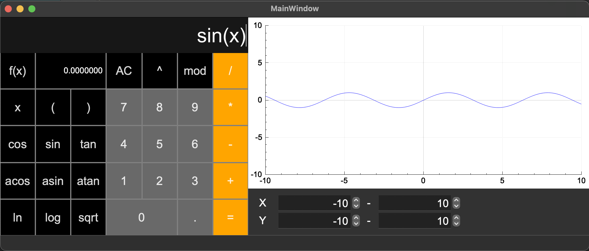

## Smart Calculator v1.0

### Introduction

This project implements an extended version of the usual calculator found in standard C programming language applications of every operating system, using structured programming and the Qt framework in C++. In addition to basic arithmetic operations such as addition/subtraction and multiplication/division, the calculator is enhanced with the ability to calculate arithmetic expressions in order, as well as some mathematical functions (sine, cosine, logarithm, etc.).
In addition to calculating expressions, it also supports using the variable x and plotting the graph of the corresponding function.

Click *f(x)* to draw a graph, below the graph you can set the area of value and the area of definition for the graph. To calculate expressions containing *x*, enter the value of *x* in the small window below the main one

### Install

Installation is done with a Makefile using the ***make install*** command. The application is built in the folder ***s21_calc***.

### Testing

For tests, use the ***make test*** and ***make gcov_report*** command to find out the coverage of the functional part.

### Other

the project is also archived with the make dist command and creates documentation with the make dvi command (example documentation is in the screenshots folder).